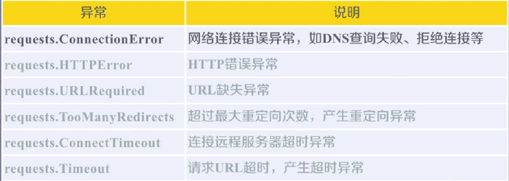

<details>
<summary>

[bit course](https://www.icourse163.org/course/BIT-1001870001)

</summary>

<details>
<summary>

week1

</summary>

request库的使用

* r = request.get() 获得一个Response对象

属性|说明
---|---
r.state_code|状态码200为成功相应
---|---
r.text|相应的字符串格式
---|---
r.encoding|解码方式
---|---
r.apparent_encoding|相应内容编码（备选编码
---|---
r.context|http相应的二进制
---|---



```python
r.raise_for_status()

# 可以在访问异常时候抛出异常信息

#以下是通用html爬取框架

def getHtml(url):
    try:
        r = requests.get(url)
        r.raise_for_status()
        r.encoding=r.apparent_encoding()
        return r.text
    except:
        return "Error"

```
</details>


</details>
