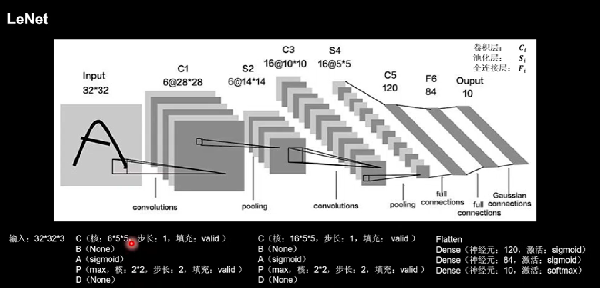

<details>
<summary>

tf描述卷积层

</summary>

```python

tf.keras.layers.Conv2d(
filters=卷积核个数,
kernel_size=卷积核尺寸(或者以元组形式给出高和宽),
strides=滑动步长,
padding="same"全零填充 or "valid"默认
activation='relu'or'sigmoid'or'tanh'or'softmax'...
input_shape=(高，宽，通道数)
)

#e.g.
model = tf.keras.models.Sequential([
Conv2d(6,5,padding="valid",activation='relu'),
MaxPool2D(2,2),
Conv2d(6,(3,2),padding="valid",activation='sigmoid'),
MaxPool2D(2,(2,2)),
Conv2d(filter=6,kernal_size=(3,2),padding="valid",activation='sigmoid'),
MaxPool2D(pool_size=(2,2),strides=2),

Flatten(),
Dense(10,activation='softmax')

])
```
</details>
<!-------------------->


<details>
<summary>

批标准化(Batch Normalization, BN)

</summary>

通过以下公式来让数据获得批标准化的特征图，H标志第k给卷积核

$\mu$是第k个卷积核，batch张输出特征所有像素点的均值

$\sigma$是第k个卷积核，batch张输出特征所有像素点的标准差，

$$H'^{k}_i = \frac{H^k_i - \mu _{batch}^k}{\sigma _{batch}^k}$$

批标准化使特征数据落在激活函数线性区域，让激活函数丧失非线性特征，因此在引入两个可训练参数$ \gamma_{k} $和$\beta_{k}$来调整批归一化力度。如下：

---

$$X_i^k = \gamma_{k}*H_i^{'k} + \beta_{k}$$

反向传播时
$\gamma$,
$\beta$
会被一同训练

```python
#e.g.
model = tf.keras.models.Sequential([
Conv2d(6,5,padding="valid",activation='relu'),
BatchNormalization(),
Activation('relu'),
MaxPool2D(pool_size=(2,2),strides=2,padding='same'),
Dropout(0.2)
])
```
</details>


<details>
<summary>

池化

</summary>

池化用于减少特征数据量。有两种池化方法
1. 最大池化
2. 均值池化

```python
#tf 描述最大池化
tf.keras.layers.MaxPool2D(
pool_size=池化核尺寸,填入整数则为正方形,否则以元组形式给出核高和核宽,
strides=池化步长或者(纵向步长，横向步长)，默认为pool_size，
padding='valid'or'same'(全零填充)

)

#tf 描述均值池化
tf.keras.layers.AveragePool2D(
pool_size=池化核尺寸,填入整数则为正方形,否则以元组形式给出核高和核宽,
strides=池化步长或者(纵向步长，横向步长)，默认为pool_size，
padding='valid'or'same'(全零填充)
)

#e.g.
model = tf.keras.models.Sequential([
Conv2d(6,5,padding="valid",activation='relu'),
BatchNormalization(),
Activation('relu'),
#->
MaxPool2D(pool_size=(2,2),strides=2,padding='same'),
Dropout(0.2)
])
```

</details>

<details>
<summary>

舍弃(Dropout)

</summary>

防止过拟合，舍弃一定比例数据
```python
#e.g.
model = tf.keras.models.Sequential([
Conv2d(6,5,padding="valid",activation='relu'),
BatchNormalization(),
Activation('relu'),
MaxPool2D(pool_size=(2,2),strides=2,padding='same'),
#->
Dropout(0.2)
])
```

</details>

<details>
<summary>

卷积神经网络

</summary>

* 卷积      (C onvolutional)
* 批标准化  (B atch Normalization)
* 激活      (A ctivation)
* 池化      (P ooling)
* 舍弃      (D ropout)
--- 
* 全连接    (F c)

</details>

<details>
<summary>

LeNet

</summary>



第一层 | 第二层 | 第三层
---|---|---
test | test2 | test3

</details>


