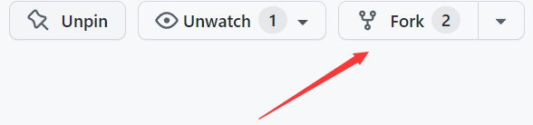
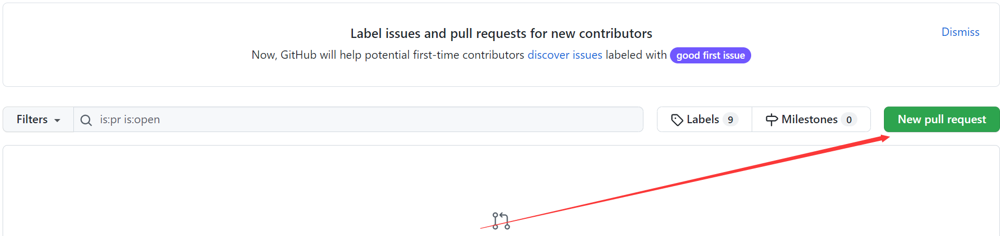

<details>
<summary>

git repos operation

</summary>

# Most used!

> git clone --- <url> <local folder name> Clone a repository into a new directory, <local folder name> can be omitted.

> git add . ---Add file contents to the index

> git pull ---upload changed files from remote repos

> git commit -m "message..."

> git push ---push to the remote branch

### Used not that frequent?maybe:-)

> git config --user.email... ---configure your info

> git status ---check your repos status.

</details>

<details>
<summary>

how to fork a branch?

</summary>

1. first step: create a fork 
2. make some change on the repos forked from the master branch
3. add a pull request on your local 


[Citation](https://blog.scottlowe.org/2015/01/27/using-fork-branch-git-workflow/)

</details>


<details>
<summary>

#### git ask your username and password every time? Don't worry, click me!

</summary>

```sh

git config --global credential.helper store
# this command will store your usrname and pwd<3
```

</details>

<details>
<summary>

#### how to use git switch branches?

</summary>

create and switch a new branch
> git checkout -b <your branch>
check out current branch
> git branch 

</details>

